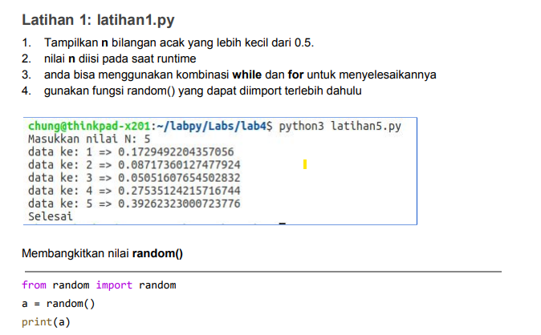

# labspy3
**Nama : OEN SAPUTRA HUTAJULU** <br>
**NIM : 312010155** <br>
**Kelas : TI.20.A.1** <br>
----------------------------

TUGAS PPT KE 3 <br>
Pada pertemuan 7 di PPT3 ini saya diberikan beberapa tugas diantaranya yaitu: <br>




untuk mengerjakannya kalian perlu memasukan sytax berikut <br>
```
import random
print(40*"=")
print("Bilangan random yang lebih kecil dari 0,5")
print(40*"=")
jum = int( input("Masukan nilai n : "))
i = 0
for i in range(jum):
    i += 1
    angkaDec = random.uniform(0, 0.5)
    print("Data ke", i, " = ", angkaDec)
Maka hasil yang didapat dari syntax tersebut adalah
```


Untuk mengerjakan soal diatas maka kita perlu memasukan atau menginput datanya terlebih dahulu baru setelah itu bisa terlihat data mana yang terbesar denagn syntax. <br>
```
N=int(input("silahkan masukan jumlah bilangan ="))
if N>0:
    i=1
    x=int(input("masukan bilangan "+str(i)+"="))
    max=x;total=x
    for i in range(2,N+1):
        x=int (input("masukan bilangan "+str(i)+"="))
        total+=x
        if max<x:
            max=x
```
    print("bilangan terbesar =",max)
Setelah itu bisa langsung kalian "RUN" untuk dapat memasukan data yang sesuai dengan yang ada di soal seperti dibawah ini <br>


```
Buka text editor seperti PyCharm, Visual Studio Code, dan lain lain. Kemudian salon kode berikut
a = 100000000
for x in range (1,9):
    if (x>=1 and x<=2):
        b=a*0
        print("laba bulan ke-",x,": ",b)
    if (x>=3 and x<=4):
        c=a*0.1
        print("laba bulan ke-",x,": ",c)
    if (x>=5 and x<=7):
        d=a*0.5
        print ("laba bulan ke-",x,": ",d)
    if (x==8):
        e=a*0.2
        print("laba bulan ke-",x,"; ",e)
total=b+b+c+c+d+d+d+e
print("\Total : ",total)
Penjelasannya sebagai berikut :
```
Variable a = 100.000.000 yaitu modal awalnya. <br>
Menggunakan fungsi looping for pada nilai x 1-9 untuk menampilkan bulan 1 sampai bulan 8. <br>
Menggunakan fungsi if, untuk menghitung laba bulan 1 sampai bulan 8. <br>
Bulan pertama dan kedua laba adalah 0. <br>
Bulan ke 3 dan bulan ke 4 mendapatkan laba sebesar 1% sehingga modal di kali 1% = keuntungan. <br>
Bulan ke 5 mendapatkan laba sebesar 5% sehingga modal dikali dengan 5% = keuntungan. <br>
Bulan ke 8 mendapatkan laba sebesar 2% sehingga keuntungan mulai menurun dari bulan sebelumnya, modal dikali dengan 2% = keuntungan. <br>
Mengitung jumlah total laba dengan mmenjumlahkan keuntungan dari bulan ke 1 sampai bulan ke 8, maka hasilnya adalah total keuntungan yang di dapat adalah total=b+b+c+c+d+d+d+e <br>
print("\Total : ",total) , untuk menampilkan hasil keseluruhan laba dari bulan ke 1 sampai bulan ke 8. <br>
Output :


----------**TERIMA KASIH**-----------------